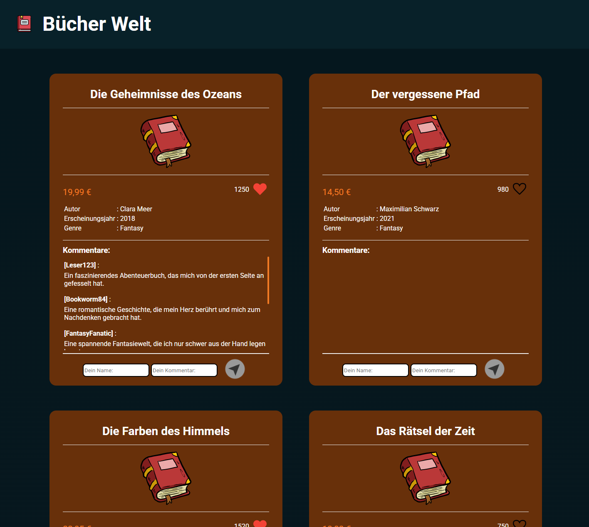

# 📚 Bücher Welt

A book catalogue app with likes and comments, built with vanilla JavaScript.

## 📌 About
Bücher Welt is a dynamic book catalogue that renders a large collection of books from a JavaScript data array. Users can like books and leave comments which are persisted via LocalStorage.

## ✨ Features
- Dynamic rendering of book catalogue from a data array
- Like functionality per book
- Comment function with LocalStorage persistence
- Book details including author, release year and genre

## 🛠️ Technologies

